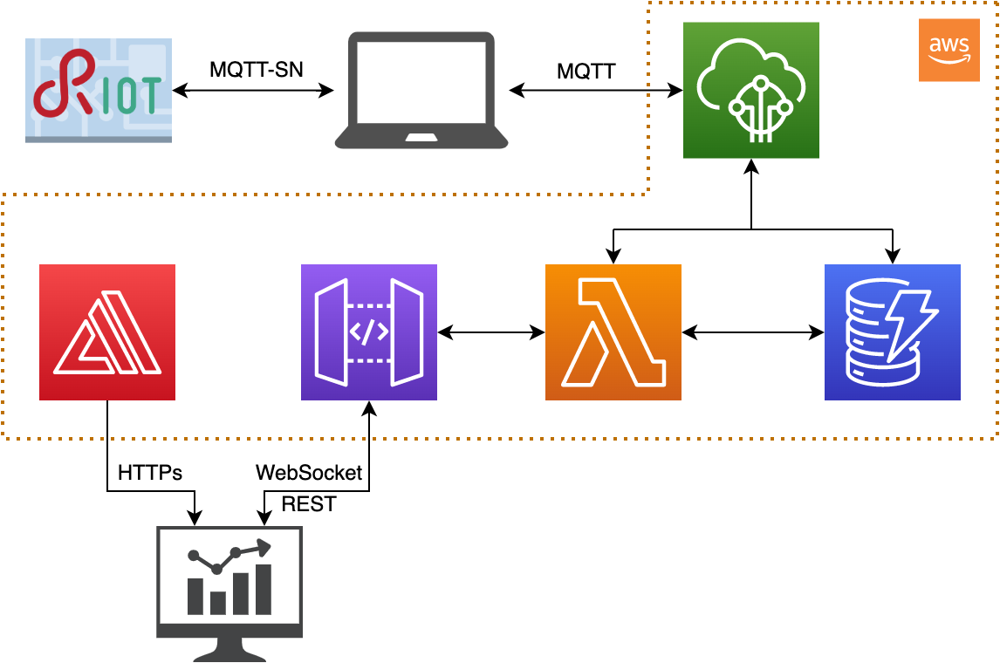
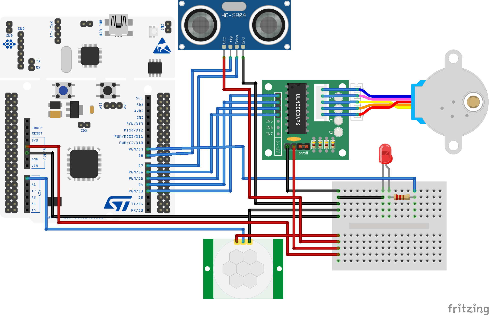

# Pet Feeder
*A team project for the embedded system course 2022 at VIT chennai*

The project was born from the need to feed the pets automatically or manually from remote places. To solve that problem we created a cloud-based IoT system that collects information from sensors and interacts with the environment using actuators.

## Architecture
The IoT device is developed using RIOT-OS and a STM NUCLEO-g474 board. The cloud-based services are based on the AWS ecosystem.
The system includes two sensors and two actuators:
- Ultrasonic sensor (HC SR04): measures the fill level of the dispenser. It is put on top of the food container and measures the distance from the food. While it is dispensed, the level goes down and the ultrasonic measures bigger distances.
After it has been activated, this sensor returns an echo back whose pulse width (uS) is proportional to the distance measured. This value can be divided by 58 to obtain the distance in cm. The resolution is 0.3cm and the minimum distance that can be measured is 2cm. For that reason, the sensor was placed 2cm above the maximum fill level of the food container.
When the container is empty the sensor is going to measure the distance from the screw. This distance will depend on the current rotation position of the screw, so values bigger than the threshold will be considered as empty level. The container will be considered filled when the sensor measures a distance equal to 2.59cm .
- PIR motion sensor (HC SR501): check if the pet is walking past the food dispenser. This sensor is always on. When it detects movements inside the range of a 110° angle and 5m distance, a 3.3V impulse of 3 seconds is sent to the analog pin. Every second the value emitted by the sensor is read from the board and if it is high (it has detected movements) it triggers the stepper motor.
- Stepper motor : rotates a screw which dispenses the food.
- Led: lights on when the food container is empty.

The board is connected through MQTT-SN to a broker hosted on the machine the board is connected to. The connection is carried out using IPv6 and RIOT-OS tap interfaces. The board publishes on “topic_out” and subscribes to “topic_in” to receive messages from outside.

A transparent bridge written in python is used to forward messages to and from AWS IoTCore. It runs on the machine the board is connected to. It reads messages from the local broker with “topic_out” and publishes them to AWS IoTCore on the same topic. It also reads messages from AWS IoTCore with “topic_in” and publishes them on the local broker with the same topic.

Once data arrives to AWS IoTCore the computation proceeds on the AWS cloud using the following services: DynamoDB, Lambda, API Gateway, Amplify.

## Logic
This IoT system follows the 'Sense-Think-Act' paradigm.

When the PIR motion sensor detects a pet walking past the dispenser it sends an impulse to an analog pin which is read every second. When the impulse is detected a callback function is called and the stepper motor is activated to do 2000 steps and dispense food. A timer is set to disable the stepper for a certain amount of time and avoid it dispensing food every time the pet walks past. The user can also dispense food from remotely using a web dashboard.

After having dispensed food, the ultrasonic sensor is activated to measure the fill level of the food container. If the value is over a threshold the led is switched on to report that it needs to be filled. If the led is on but the container has been filled, it is switched off.

The application collects and stores only the fill level coming from the ultrasonic sensor. This happens after every time food is dispensed, both if as a consequence of motion detection or if the user has manually dispensed it. These data are then stored in AWS DynamoDB to be included in the web dashboard.

The computation linked to sensors and actuators is carried on entirely on the board. This choice was made because the board could provide the required computational power and it avoided higher latencies to send data to the cloud and retrieve the instructions to be performed. This choice also reduced the number of messages exchanged over the network and the cloud usage.

The cloud only manages the communications with the user via the web dashboard. The following AWS services were used:

DynamoDB:
- table: connections; partition key: conn_id (String).
- table: pet_feeder; partition key: id_time (Number); column: fill_level (String).

API Gateway:
- name: update_level; protocol: WebSocket; routes: connect (linked to lambda function websocket_connect.py) and disconnect (linked to lambda function websocket_disconnect.py).
- name: petfeeder_api; protocol: REST; resources: GET (linked to lambda function read_level_from_db.py) and POST (linked to lambda function publish_dispense_to_iotcore.py).

AWS Amplify:
- Code inside WebApp folder.

IoTCore:
- rule: perfeeder_store; rule query statement: SELECT message FROM 'topic_out'; actions:
Insert a message into a DynamoDB table (partition key value: ${timestamp()}; write message data to this column: fill_level) and
Send a message to a lambda function (send_to_websocket.py).
- messages format: topic_in {“message” : “dispense”}; topic_out {“message” : “%value”} where %value is an integer.

Lambda functions:
- publish_dispense_to_iotcore: publishes the dispense message to topic_in.
- read_level_from_db: returns the elements from DynamoDB table “pet_feeder” whose id_time is not older than one hour before when it is called.
- send_to_websocket: sends the new value to all active WebSocket connections.
- websocket_connect: stores in DynamoDB table “connections” the connection id in input.
- websocket_disconnect: deletes from DynamoDB table “connections” the connection id in input.

Policies were set up using AWS IAM (Identity and Access Management) to ensure proper communication between the above services.

## Circuit Diagram :

## Things to do:
- Configure and solve IoTcore errors in AWS.
- Configure AWS Amplify.
- Configure the MQTT protocol which provides a lightweight method of carrying out messaging using a publish/subscribe model.
- Update transparent python bridge.
- Connect the board and the system.
- Create better hardware design for pet feeder.
- Open the WebApp after the link generated by AWS amplify and use the system.

<!-- #### [Here](https://www.hackster.io/andrear632/automatic-pet-feeder-0c2639)  is the reference of this project. -->

